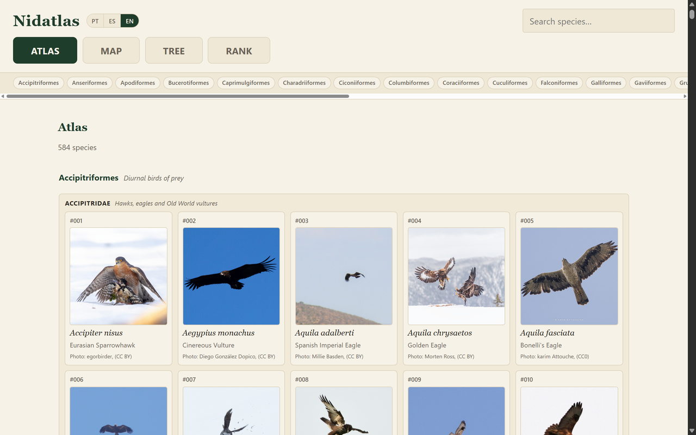
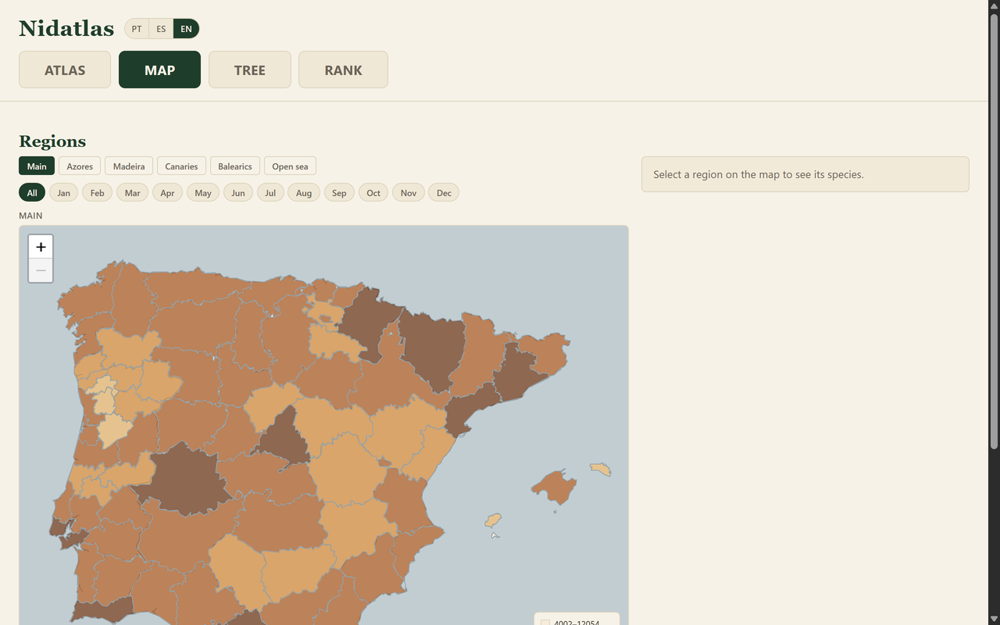
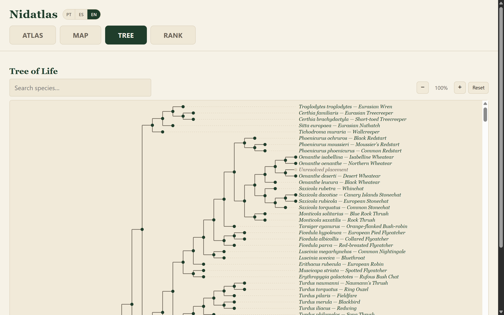
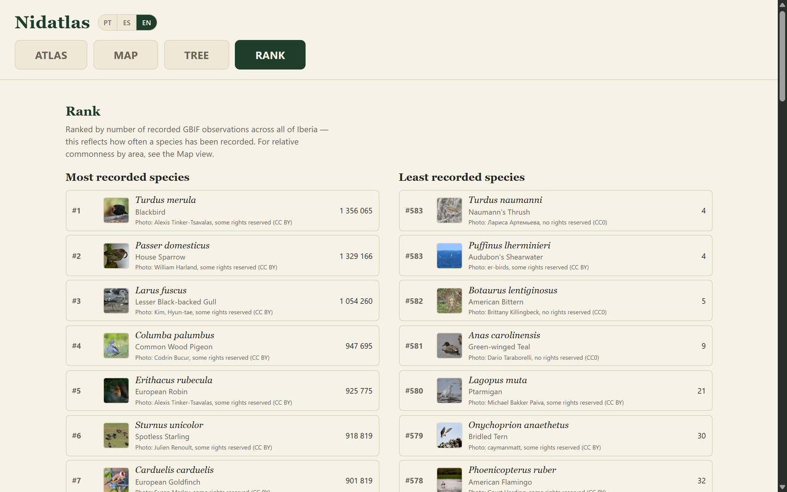
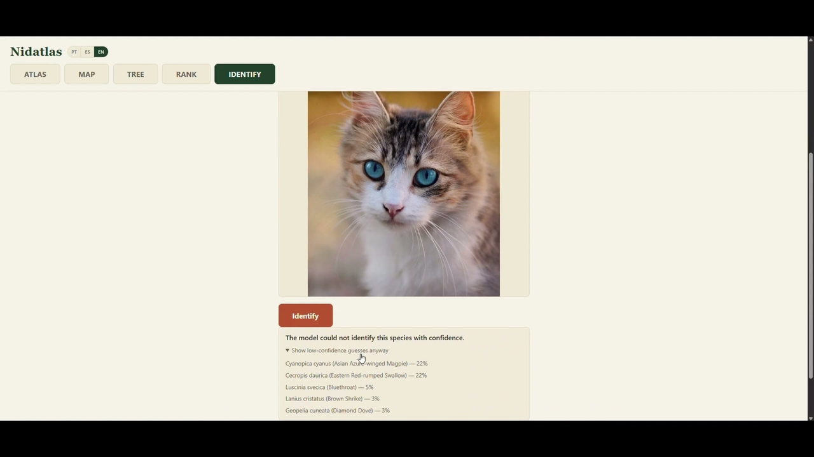

# Nidatlas

[](https://github.com/paulofreitas55/Nidatlas/actions/workflows/ci.yml)

A web atlas of the birds of the Iberian Peninsula — Portugal and Spain,
including the Azores, Madeira, the Canary Islands and the Balearics — built
on public GBIF occurrence data.

**Live at [nidatlas.com](https://nidatlas.com).**

| Atlas | Map |
|---|---|
|  |  |
| **Tree** | **Rank** |
|  |  |

## What it does

Four views, all live, all fully localised in **Portuguese, Spanish and
English**:

- **Species atlas** (the landing page) — all ~584 Iberian bird species as a
  browsable, searchable card grid grouped by taxonomic order and family,
  each with a real photo (see Photo credits below).
- **Region map** — every district, province and named island shaded by
  total bird occurrences, with a side panel showing which species are most
  and least characteristic of the region you click, and a month filter.
  Species pages (reached from either the atlas or the map) add a
  seasonality chart, a distribution map down to a 10km grid cell —
  including archipelago-aware views for island endemics — and the
  species' position in the tree of life with its closest relatives.
- **Tree of life** — the full phylogeny (Open Tree of Life) for every
  placed species, as a navigable rectangular cladogram.
- **Rank** — every species ordered by raw recorded-occurrence count, most
  and least, clearly labelled as observation records rather than actual
  abundance (see the Region map for relative commonness by area).

### Species identification — built, not deployed

A fifth view, **Identify**, is fully implemented and tested but not live:
upload or take a photo of a bird and get a BioCLIP 2 model's top-5 guesses
among Iberia's 584 species, each linked to its species page, with a
confidence score and an explicit "not confident" state rather than a
false-certain answer. A photo is used only to run identification, never
stored or shared, and discarded once a result is returned — see the
Privacy page (`/privacy`) for the full statement.

It's gated behind `ENABLE_IDENTIFY` (off by default) and left out of the
hosted deployment specifically because of its measured resource cost: once
the model loads, it holds **~6.8GB RAM**, and a cold start (Container Apps
scaling from zero replicas) takes **~77 seconds** for the first request —
both incompatible with the free-tier scale-to-zero hosting this project
runs on. Nothing about the feature is unfinished: it's containerizable
(`docker build --build-arg INCLUDE_IDENTIFY=true`), covered by tests
(mocked, so the suite doesn't need the real model installed to run), and
ships as a standalone CLI too (`scripts/identify.py`, usable without the
web app at all). See [CLAUDE.md](CLAUDE.md)'s Deployment section for the
full measurements and the two paths to enabling it on the live deployment
later (baking in the model weights, resolving the memory footprint).

**Demo** (recorded locally with `ENABLE_IDENTIFY=1`, since this view isn't
live on nidatlas.com): six photos — five real Iberian birds and one cat, to
also show how the model handles a subject outside its 584-species scope.
The frame below is the cat result; click it to open/download the full
video (MP4, ~3.7MB — GitHub doesn't inline-preview video committed to a
repo, so this opens the file's own page rather than playing in place).

[](docs/identify-demo.mp4)

### Enabling photo identification locally

```powershell
pip install -r requirements-identify.txt   # pybioclip/PyTorch -- not in requirements.txt itself
$env:ENABLE_IDENTIFY = "1"
python src/api.py
```

See CLAUDE.md's "IDENTIFY feature isolation" design decision for how this
gating works end to end (backend routes, frontend nav, lazy model import).

### Photo credits

Every species photo is hotlinked from iNaturalist (research-grade,
community-licensed observations) or, as a fallback, Wikidata/Commons —
never downloaded or re-hosted. Only CC0 and CC-BY images are used; CC-BY-SA
is deliberately excluded (see CLAUDE.md's "Species photo cascade" design
decision for why, and the measured coverage cost of that choice). Each
photo is shown with its photographer's name and licence, and links back to
the original observation or file page.

## Tech stack

- **Backend:** Python, [FastAPI](https://fastapi.tiangolo.com/), SQLite (no
  ORM — plain `sqlite3` + hand-written SQL in `src/queries.py`)
- **Data pipeline:** pandas, pyarrow, shapely, pyproj — see
  [CLAUDE.md](CLAUDE.md) for the full script-by-script rebuild order
- **Species identification:** [BioCLIP 2](https://github.com/Imageomics/bioclip-2) via `pybioclip`
- **Frontend:** vanilla JavaScript, no framework or build step, [Leaflet](https://leafletjs.com/) for mapping
- **Tests:** pytest, against a real FastAPI app + real local database

## Setup

```powershell
python -m venv .venv
.venv\Scripts\Activate.ps1
pip install -r requirements.txt
```

`data/` and the generated `static/*.geojson` files are not included in the
repository (gitignored build artifacts). To run the app locally you need to
either obtain a copy of `data/nidatlas.db` and the built GeoJSON files, or
rebuild everything from scratch from the GBIF downloads below — see
[CLAUDE.md](CLAUDE.md) for the exact script order. Once the database
exists:

```powershell
python src/api.py
```

Serves at `http://0.0.0.0:8000/` by default (override with the `HOST`/`PORT`
env vars, e.g. `HOST=127.0.0.1` for a strictly local-only bind). Run the
tests with:

```powershell
python -m pytest tests/ -q
```

Alternatively, build and run the Docker image (requires `data/nidatlas.db`
and the generated `static/*.geojson` files to already exist locally — they
get baked into the image at build time, see
[CLAUDE.md](CLAUDE.md#deployment)):

```powershell
docker build -t nidatlas .
docker run -p 8000:8000 nidatlas
```

## Data sources

Full provenance, licences and required attributions for every external
dataset, model and library this project depends on are tracked in
**[ATTRIBUTIONS.md](ATTRIBUTIONS.md)**. Summary of the two GBIF downloads
this project is built on:

**Species list.** GBIF.org (27 August 2026) GBIF Occurrence Download
https://doi.org/10.15468/dl.sddbky

Covers bird species of Portugal and Spain. Includes only CC0 and CC-BY
licensed records.

**Occurrence cube.** GBIF.org (28 August 2026) GBIF Occurrence Download
https://doi.org/10.15468/dl.kb6cwg

Species × year-month × MGRS 10km grid, for birds of Portugal and Spain.
Includes only CC0 and CC-BY licensed records, with family-level counts for
sampling-bias normalisation.

**Country boundaries.** `static/iberia.geojson` is built in two stages.
`scripts/build_land_polygons.py` clips OpenStreetMap's
[land-polygons](https://osmdata.openstreetmap.de/data/land-polygons.html)
dataset (coastline-derived, ODbL 1.0, © OpenStreetMap contributors) to the
study bounding box. This replaced two earlier Natural Earth-based attempts
(1:50m, then 1:10m admin-0 boundaries) that kept silently dropping small
islands — Porto Santo, Corvo, Graciosa, and, even at 1:10m, the uninhabited
Desertas, Selvagens and La Graciosa (Canaries) reserves — since OSM's land
polygons are coastline-derived rather than country-bounded, so they include
every islet regardless of habitation status. But that same property means
the bbox-clipped output also fuses mainland Iberia into France, Andorra and
a sliver of Morocco/Western Sahara, since OSM doesn't split land by country.
`scripts/clip_land_to_countries.py` removes that: it intersects the OSM
land against Natural Earth's admin-0 Portugal + Spain polygons (public
domain, used purely as a clip mask) and re-simplifies the result, keeping
OSM's fine coastline detail (e.g. the Galician rias) everywhere except the
new inland France/Andorra edge.

**Administrative regions.** `static/regions.geojson` (the 73
districts/provinces + 24 named islands shown on the region map) is built by
`scripts/build_regions.py` from Eurostat GISCO's NUTS3 boundaries (naming
and mainland shapes) combined with the OSM land layer above (island
shapes — GISCO's own island geometry is too coarse to align with the
coastline the map actually draws). See [CLAUDE.md](CLAUDE.md) for why.

## Known limitations

- **Taxonomy version mismatch.** GBIF's current backbone and BioCLIP 2's internal vocabulary disagree on naming for a number of species (recent genus splits, spelling variants). This is resolved via `data/taxonomy_synonyms.csv`, which maps GBIF names to the BioCLIP-recognized equivalent used at inference time.
- **Genus-lumping cases.** For 4 species, BioCLIP has no equivalent for a recent species-level split and only recognizes the older, broader parent taxon. Predictions for these will surface the parent name, not the split:
  - `Circus hudsonius` → `Circus cyaneus`
  - `Strix mauritanica` → `Strix aluco`
  - `Cecropis rufula` → `Cecropis daurica`
  - `Calonectris borealis` → `Calonectris diomedea`
- **`Ardea brachyrhyncha` excluded.** No BioCLIP-recognized equivalent could be resolved for this species, confidently or otherwise, so it is dropped from `data/iberian_species.txt` rather than mapped to a guess.
- **The 50-occurrence threshold is a tunable product decision, not a fixed rule.** `scripts/build_species_list.py --min-occurrences` defaults to 50 to exclude vagrants and data noise, but this cutoff was chosen as a reasonable starting point, not derived from any formal analysis — revisit it as the atlas's species coverage needs evolve.
- **Grid choice: EEA reference grid replaced with MGRS.** The initial occurrence cube used the EEA reference grid (ETRS89-based, continental Europe coverage), which fails to assign a cell to most records from the Macaronesian islands (Azores, Madeira, Canaries) — leaving island endemics like `Regulus madeirensis` and `Pyrrhula murina` without any spatial data at all. The cube was regenerated using the MGRS 10km grid, which has global coverage, including pelagic records.
- **7 species have no placement in the phylogenetic tree.** All 584 species resolve to a valid Open Tree of Life taxon (`scripts/fetch_phylogeny.py`), but 7 of those taxa aren't sampled by any input phylogeny in synthesis `opentree16.1`, so they have no tip in `phylo_nodes`. Six are folded into an ancestor placeholder node by the `induced_subtree` endpoint itself:
  - `Calandrella brachydactyla`
  - `Himantopus himantopus`
  - `Oenanthe hispanica`
  - `Porphyrio porphyrio`
  - `Spatula cyanoptera` (matched as `Anas cyanoptera`)
  - `Tyto alba`

  The seventh, `Emberiza rustica`, is more severe: its exact taxon match is flagged `"hidden"` in Open Tree's own taxonomy, so `induced_subtree` refuses the id outright rather than folding it into a placeholder. `src/queries.py`'s phylogeny functions treat all 7 as a valid "no tree placement" outcome (empty relatives list, not a 404), never a guessed-at position. See `scripts/fetch_phylogeny.py`'s own report for the up-to-date list if the resolution is ever rerun.
- **Deployment is manual, including to Azure.** CI ([GitHub Actions](https://github.com/paulofreitas55/Nidatlas/actions), see [CLAUDE.md](CLAUDE.md)'s CI section) runs the test suite on every push and pull request, but does not build, push, or deploy anything. Building the Docker image, pushing it to the registry, and deploying to Azure Container Apps are all run by hand, deliberately — the app's Azure subscription sits in an institutional Entra ID tenant that restricts app-registration creation to admins, which is what GitHub Actions → Azure OIDC authentication requires. See CLAUDE.md's CI section for the exact manual commands and the steps that would enable automating this if that restriction is ever lifted.
- **The live deployment ships with IDENTIFY off** — see "Species identification — built, not deployed" above for the measured reason (~6.8GB RAM, ~77s cold start) and what would change to turn it on; a rollout decision, not a feature removal.
- **Data updates require a rebuild.** `data/nidatlas.db` and the generated `static/*.geojson` files are baked into the Docker image at build time, not fetched at runtime — updating the data means rebuilding and redeploying the image, not editing a live volume. See CLAUDE.md's Deployment section.
- **Rate limiting is single-process only, for now.** Both `/api/identify`'s and the general `/api/*` rate limiter keep their counters in memory, scoped to one running process — correct for the current single-worker deployment, but would need moving to a shared store or a reverse-proxy/CDN layer before running multiple workers or replicas. See CLAUDE.md's rate-limiting design decisions.

## License

The code in this repository is [MIT licensed](LICENSE). That covers the
code only — the bundled GBIF occurrence data, GISCO administrative
boundaries, OpenStreetMap land polygons, species photos, and the BioCLIP 2
model each carry their own separate licence and attribution requirements;
see [ATTRIBUTIONS.md](ATTRIBUTIONS.md) for the full, source-by-source
breakdown before reusing any of it.
